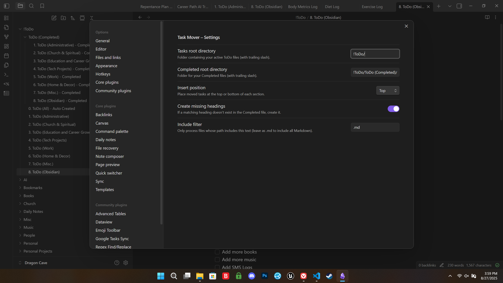
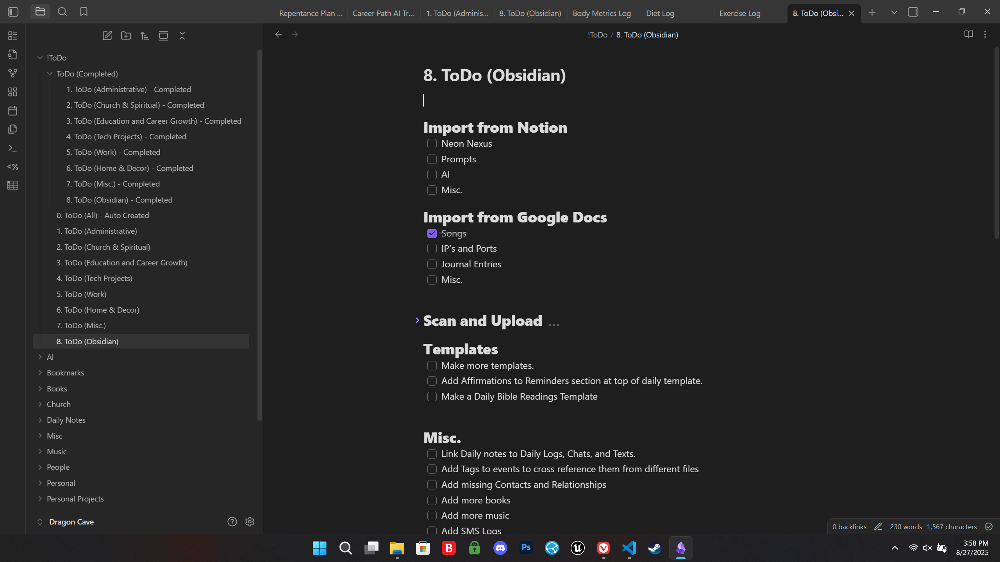
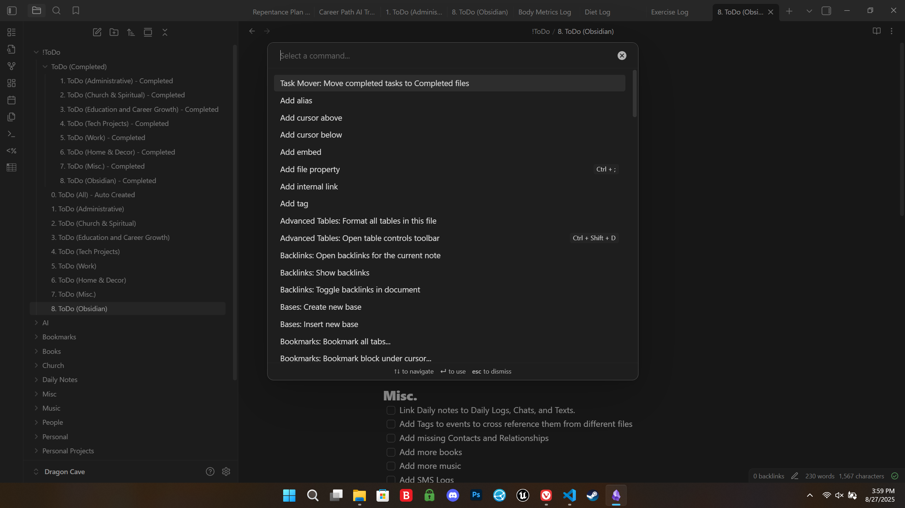
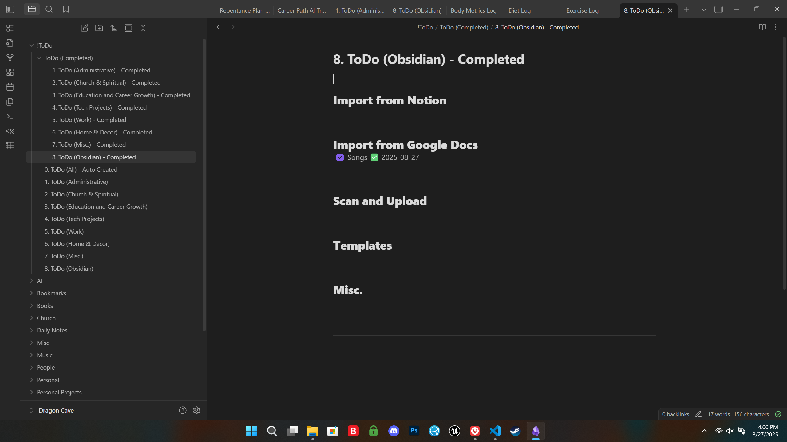

Task Mover

Move completed tasks from your active ToDo files into matching “Completed” files — preserving headings, structure, and dates.
Designed for clean daily sweeps, not one-by-one moves.

## ✨ Features

**Command Palette action:**
Run _“Move completed tasks to Completed files”_ to sweep all checked tasks.

**Preserves files and headings:**
Tasks stay organized under the same sections in your Completed files.

**Automatic ✅ date stamps:**
If a completed task doesn’t have one, today’s date is added.

**Configurable placement:**
Choose whether completed tasks insert at the top or bottom of each section.

**Customizable paths:**
Set your Tasks root folder and Completed folder.

**Safe batching:**
Tasks remain in their active file until you explicitly run the command.

## ⚙️ Settings

**Tasks root directory**
Folder containing your active ToDo files. Default: !ToDo/

**Completed root directory**
Folder containing your Completed files. Default: !ToDo/ToDo (Completed)/

**Insert position**
Whether completed tasks go at the top or bottom of each heading section.

**Create missing headings**
If a heading doesn’t exist in the Completed file, the plugin will create it.

**Include filter**
Only process files containing this text (default: .md).

## 📂 Example Workflow

Active file "!ToDo/1. ToDo (Administrative).md":

#### **Business & Administrative**
- [ ] Renew Drivers License
- [x] Cancel gym membership

After running the command, Completed file "!ToDo/ToDo (Completed)/1. ToDo (Administrative) - Completed.md":

#### **Business & Administrative**
- [x] Cancel gym membership ✅ 2025-08-26

## Installation
Community Plugins (recomended method after approval into community plugins)

Open Settings → Community Plugins.

Browse or search for Task Mover.

Install and enable.

### Manual Install (If not available in Community Plugins)

Download the latest release from GitHub Releases.

Copy all files from this github repo into:
<your-vault>/.obsidian/plugins/task-mover/

Reload Obsidian and enable the plugin.

🛠 Development
### install dependencies
npm install

### build once
npm run build

### build and deploy into your vault (update copy.js VAULT_PATH)
npm run build:vault

## 📜 Changelog

See CHANGELOG.md
.

📄 License

This plugin is licensed under the MIT License.
© 2025 Glen Bland / Waypoint Labs

## ❤️ Credits

Built by Glen Bland at Waypoint Labs.

Special thanks to the Obsidian developer community for sample code and docs.